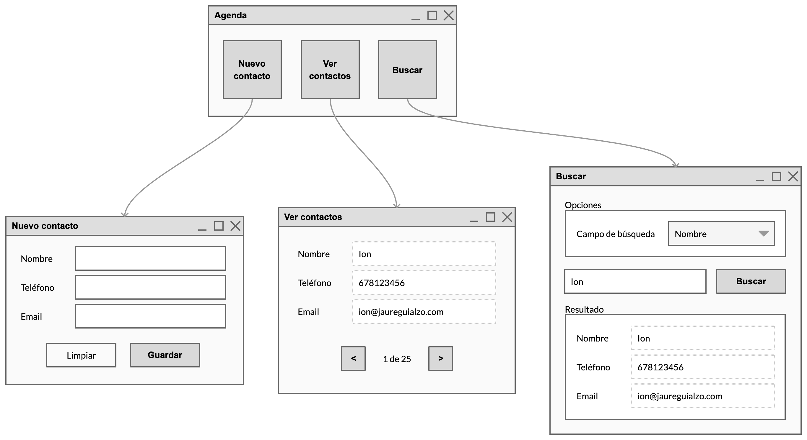
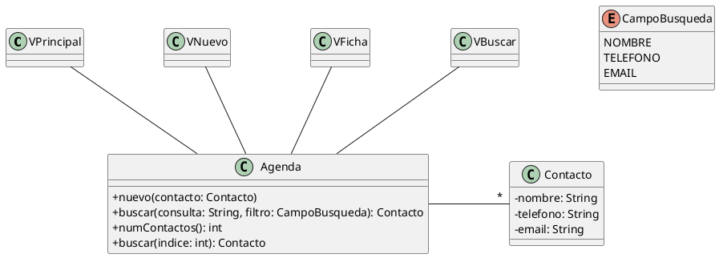

# Agenda

Crea una aplicación para mantener una agenda de contactos con un interfaz de usuario como el de este *mockup*:

## Funcionamiento

La aplicación tiene tres componentes:

- Nuevo contacto: permite crear una nueva entrada en la lista de contactos.
- Ver contactos: muestra, de uno en uno, todos los contactos y permite desplazarse de uno a otro, indicando en todo momento en cual estamos.
- Buscar: permite seleccionar por cual de los tres campos (nombre, teléfono o email) queremos hacer la búsqueda y muestra el primero que coincida con el criterio, si lo hay.

## Diagrama de clases

La aplicación tendrá esta estructura de clases:

## Restricciones

- La función `main()` estará en la clase `Agenda` y mostrará la ventana `VPrincipal` al arrancar.
- Controla las posibles excepciones y muestra los mensajes de error adecuados.

## Sugerencias

Para que la búsqueda sea eficiente, utiliza diccionarios para almacenar los contactos.
